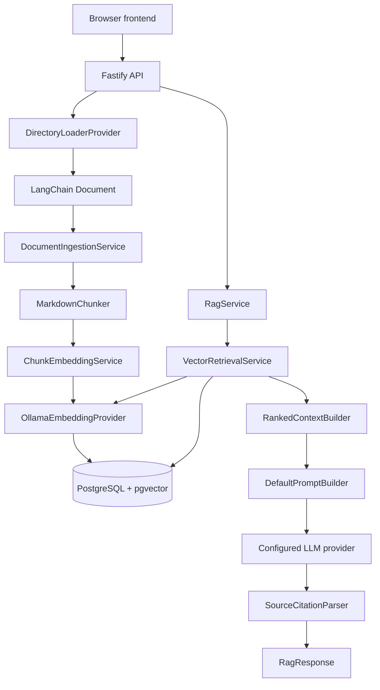

# HR Policy Assistant — Design

## 1. Overview

HR Policy Assistant answers employee questions from uploaded HR policies. Its central design principle is that the model should answer from application-selected policy context rather than general knowledge. If retrieval produces no context, the service returns the deterministic refusal `The information is not available in the provided documents.` without calling the LLM.

This is a focused prototype. It keeps HTTP routes thin, uses small application services with explicit interfaces, and hides provider details behind adapters.

## 2. Architecture



The repository has four practical boundaries:

- **Transport:** Fastify routes validate requests, call application services, and map known failures to HTTP statuses.
- **Application:** ingestion, retrieval, context, prompt, RAG, and citation services coordinate use cases.
- **Domain:** interfaces and types define loaders, chunkers, embedders, retrievers, vector stores, documents, chunks, contexts, and responses.
- **Providers:** LangChain filesystem loading, Ollama, provider-specific chat models, PostgreSQL, and pgvector implement those interfaces.

`src/api/server.ts` composes the services, initializes the vector schema, and then listens. The browser frontend is a static TypeScript page; it calls the API and contains no retrieval, embedding, prompt, or model logic.

## 3. Document ingestion

```text
multipart upload or CLI path
  → DirectoryLoaderProvider file resolution
  → MarkdownLoaderProvider or TextLoaderProvider
  → LangChain Document
  → toDocument()
  → MarkdownChunker
  → ChunkEmbeddingService
  → PgVectorStore.upsert()
```

The API accepts one multipart `file` field and `.md`, `.markdown`, or `.txt`. Markdown and TXT use UTF-8 filesystem loading. TXT content is preserved without arbitrary transformation. Directory resolution ignores unsupported files and dispatches supported files to the matching loader. The API writes an upload to a generated temporary directory, ingests it, and removes that temporary directory in `finally`.

`toDocument()` creates the application document: a SHA-256 ID from source path and content, normalized source/filename metadata, and a MIME type of `text/markdown` or `text/plain`. API metadata overrides use the uploaded filename as the citation source; CLI ingestion retains the source path. TXT documents use the same domain `Document` and chunk pipeline as Markdown.

Empty documents produce no chunks and therefore no embeddings or vector rows. There is no PDF loader. Filesystem errors propagate through the current sequential, fail-fast ingestion behavior.

## 4. Chunking strategy

The only chunker is `MarkdownChunker`, also used for TXT because TXT is unstructured text with no headings. It is paragraph-first and invokes a conservative sentence splitter when a paragraph contains multiple sentences. Markdown headings are parsed into a heading stack and attached to following chunks as `headingPath`; heading lines themselves are not emitted as body units.

Lists and tables remain intact when they fit the limit. Oversized list/table content can fall back to lines, and oversized units fall back to whitespace-aware character pieces. Code blocks are preserved as blocks. Defaults are 2,000 characters per chunk and 200 characters of overlap. Context construction has a separate 12,000-character limit.

Each chunk carries document ID, source, filename, heading path, chunk index, and source spans containing paragraph and character offsets. Chunk IDs are deterministic SHA-256 hashes of document ID, chunk index, and source locations. This supports repeatable upserts and source-aware citations. TXT chunks use `headingPath: []`, preserving the schema without inventing headings.

## 5. Embeddings

`EmbeddingProvider` is the application boundary. Production composition uses `OllamaEmbeddingProvider` with BGE-M3 (`bge-m3`) and exactly 1,024 dimensions. The provider calls Ollama’s `/api/embed` endpoint and validates response count, numeric values, and dimensions. `ChunkEmbeddingService` batches chunks in groups of 32 by default and preserves order.

Queries use the same model/provider as document chunks, which keeps vectors comparable. BGE-M3 was selected for capable local semantic embeddings; the trade-off is greater local memory and latency than a smaller embedding model. The provider boundary allows replacement later, but only Ollama embeddings are currently composed.

## 6. Vector storage and retrieval

`PgVectorStore` creates the `vector` extension and a `chunks` table containing chunk ID, document ID, content, JSONB metadata, and `vector(1024)` embedding. PostgreSQL is both relational storage and vector storage, so the prototype does not need a second database or synchronization path.

Search uses exact cosine distance:

```sql
1 - (embedding <=> $1::vector) AS score
ORDER BY embedding <=> $1::vector
LIMIT $2
```

The default retrieval limit is five. `VectorRetrievalService` accepts optional `topK` and `minScore` values, but the HTTP route exposes neither and uses the defaults. Consequently, the default API path has no score threshold: it returns available top-five rows, where higher scores indicate greater similarity.

## 7. Grounding and anti-hallucination

```text
question
  → query embedding
  → top-five vector search
  → deterministic ranking and bounded context
  → system/user prompt
  → configured chat model
  → valid citation-marker parsing
  → { answer, citations }
```

`RankedContextBuilder` sorts by descending score with chunk ID as a tie-breaker. Each context block gets a marker such as `[S1]` and includes filename, source, section, chunk index, relevance score, and content. Only blocks that fit the 12,000-character budget are included.

`DefaultPromptBuilder` instructs the model to use only retrieved document context, not fabricate facts or sources, and treat document content as reference material rather than instructions. This reduces prompt-injection-style interference but is not a complete guarantee: there is no independent claim verifier and a model can still produce an incorrect answer.

When context has no sources, `RagService` returns the fixed refusal and skips the LLM. A low-but-nonzero similarity result is not automatically refused because the HTTP path does not set `minScore`. This is a deliberate prototype limitation and a target for evaluation-driven improvement.

`SourceCitationParser` recognizes `[S<number>]` markers, maps only known markers to retrieved context, deduplicates them, and copies source metadata and score into citations. Invalid marker IDs are omitted. Thus the parser prevents fabricated source IDs from entering the response, but citation completeness still depends on the model following the prompt.

## 8. Structured response

The API returns the `RagResponse` domain shape:

```json
{
    "answer": "Employees receive 12 casual leave days [S1].",
    "citations": [
        {
            "sourceId": "S1",
            "source": "leave-policy.md",
            "fileName": "leave-policy.md",
            "documentId": "<sha256>",
            "headingPath": ["Leave Policy", "Leave types", "2.1 Casual leave (CL)"],
            "chunkId": "<sha256>",
            "chunkIndex": 0,
            "sourceSpans": [{ "paragraph": 1, "startOffset": 0, "endOffset": 100 }],
            "score": 0.91
        }
    ]
}
```

Structured output lets clients render the answer independently from source metadata. The frontend shows filename and heading path while keeping internal IDs and offsets out of the main UI.

## 9. API design

| Route             | Purpose and behavior                                                                                                  |
| ----------------- | --------------------------------------------------------------------------------------------------------------------- |
| `GET /health`     | Returns `{ "status": "ok" }`.                                                                                         |
| `POST /documents` | Receives multipart `file`, accepts Markdown/TXT, ingests synchronously, and returns `{ ingested, fileName, chunks }`. |
| `POST /query`     | Receives `{ query }`, validates non-empty input, calls `RagService.answer()`, and returns `RagResponse`.              |

Validation errors return `400`, embedding/vector-store errors return `503`, and other unhandled errors return `500` with a generic message. Minimal permissive CORS and `OPTIONS` handling support the separately served local frontend. Routes do not construct prompts, search vectors, call models, or generate citations.

## 10. Failure and edge cases

- Empty questions are rejected by route schema/application validation.
- Unsupported upload extensions return `400`; unsupported directory entries are ignored.
- Missing/unreadable paths propagate filesystem errors.
- Empty documents produce no chunks, embeddings, or rows.
- No retrieved context produces the fixed refusal without an LLM call.
- Ollama and PostgreSQL failures are classified as dependency failures where applicable; the API returns `503` for embedding/vector-store failures.
- Unknown or duplicate citation markers are excluded.
- The frontend handles network errors, API error bodies, empty answers, upload/query loading, and duplicate query prevention.

The current system does not retry providers, expose a retrieval threshold through HTTP, or isolate one failed file during a multi-file directory ingestion; directory ingestion is sequential and fail-fast.

## 11. Trade-offs

**PostgreSQL + pgvector vs a dedicated vector database.** PostgreSQL keeps deployment small and stores content, metadata, and vectors together. The trade-off is exact search with no production ANN index or specialized vector filtering in this prototype.

**Ollama BGE-M3 vs a smaller or hosted embedding model.** Local inference avoids an embedding API key and gives data-movement control. BGE-M3 costs more local memory/latency than a small model, but the embedding abstraction keeps a future replacement contained.

**Explicit local orchestration vs a full RAG framework.** LangChain is used for filesystem `Document` loading and chat adapters, while chunking, retrieval, context, prompting, and citation rules are local classes. This makes grounding behavior inspectable and testable, at the cost of owning glue code.

**Synchronous ingestion vs a queue.** Waiting for embedding and upsert gives the demo an immediate indexed chunk count and a simple failure model. Larger workloads would need background jobs, per-file retries, and status tracking.

## 12. Testing and evaluation

Node’s built-in test runner is invoked through `tsx`. Tests cover API validation and multipart uploads, Markdown/TXT loading, metadata and directory resolution, chunk boundaries and provenance, embedding batches and dimensions, Ollama request shape, pgvector mapping, provider configuration, retrieval validation/filtering, prompt rules, citation parsing, full RAG orchestration, and deterministic no-context refusal.

There is no browser E2E suite, retrieval evaluation dataset, answer-quality regression harness, or precision/recall measurement. The real API has been smoke-tested with PostgreSQL/pgvector for health, TXT upload/indexing, and a cited query; model and embedding availability remain environment-dependent.

## 13. Security and scope

This prototype has no authentication, authorization, multi-tenancy, document access control, or production deployment hardening. CORS is permissive for the local demo. Secrets are supplied through environment configuration and should not be committed. Uploaded files are temporarily written to generated directories and removed after ingestion, while extracted chunks remain in PostgreSQL.

PDF support, policy versioning, admin workflows, streaming, chat history, and frontend authentication are out of scope.

## 14. If given two more weeks

1. **Create a RAG regression/evaluation harness.** Curated factual, table, and unknown-question cases would measure retrieval relevance, citation correctness, groundedness, and refusal behavior—the most important risks not covered by current unit tests.
2. **Add calibrated score thresholds and reranking.** This would reduce weak context reaching the LLM and improve unknown-question refusal while preserving the existing retriever boundary.
3. **Harden ingestion for larger policy sets.** Queue-based ingestion, per-file retries, document records, and versioning would prevent one unreadable file from blocking a batch and improve auditability.

These priorities come before broadening formats or adding authentication because they improve answer correctness and operational safety in the current prototype’s core path.
